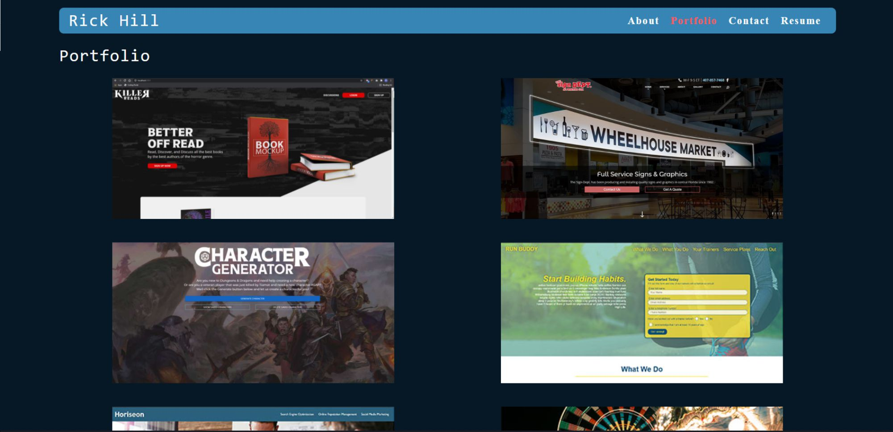

# Ricks React Portfolio

## Description

This repo contains a reactjs based portfolio. Utilizing the virtual DOM, this single page application is fast and responsive. Checkout out some of my latest projects and get in touch!

## Table of Contents

* [Installation](#installation)

* [Usage](#usage)

* [Credits](#credits)

* [License](#license)

 

* Displays an About Me section
* Showcases some of my latest works
* Provides multiple contact methods
* Allows for a downloadable resume

 

This portfolio is designed to give interested viewers a glimpse into my life and work.

 

[Ricks React Portfolio](https://rickhill543.github.io/ricks-react-portfolio/)

***

## Installation

Visit the link above!

***

## Usage

This application is used to showcase ability to any potential employer or contractor.

 

***

## Credits

W3Schools for always being there | 
[W3Schools](https://www.w3schools.com/)

 

***

## License

All Rights Reserved.
